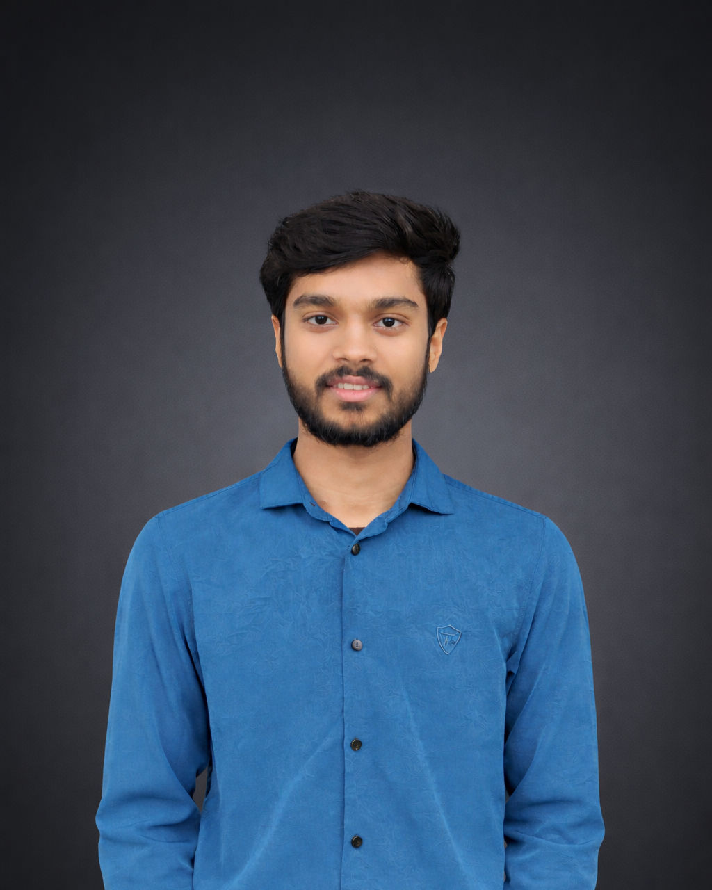

# 🚀 Taslim Ahmed Tamim | Portfolio

A futuristic, interactive personal portfolio showcasing my skills, projects, and journey as a Full Stack Developer & Competitive Programmer.



## ✨ Features

- **Futuristic Design** - Dark theme with glowing accents, glassmorphism effects, and smooth animations
- **Interactive Background** - Particle canvas animation with mouse interaction
- **Responsive Layout** - Optimized for desktop, tablet, and mobile devices
- **Smooth Scrolling** - Performance-optimized scroll behavior
- **Dynamic Typing Effect** - Animated text showcasing different skills
- **Project Showcase** - Filterable project gallery with categories
- **Skills Section** - Visual representation of technical skills with progress bars
- **Contact Section** - Easy ways to connect via email and social media

## 🛠️ Tech Stack

- **HTML5** - Semantic markup
- **CSS3** - Custom properties, Flexbox, Grid, animations
- **JavaScript** - Vanilla JS with ES6+ features
- **Font Awesome** - Icons
- **Google Fonts** - Orbitron & Work Sans typography

## 📁 Project Structure

```
portfolio/
├── index.html          # Main HTML file
├── styles.css          # All styles and animations
├── script.js           # JavaScript functionality
├── assets/
│   └── tamim.png       # Profile image
├── docs/
│   └── Taslim-Ahmed-Tamim-Resume.pdf
└── README.md
```

## 🎨 Sections

| Section | Description |
|---------|-------------|
| **Hero** | Introduction with profile image, stats, and call-to-action buttons |
| **About** | Personal story, mission, and highlights |
| **Skills** | Programming languages, web stack, databases, and tools |
| **Projects** | Filterable gallery of completed and ongoing projects |
| **Blog** | Signal log for sharing insights and discoveries |
| **Contact** | Email, location, and social media links |

## 📱 Responsive Breakpoints

- **Desktop**: 900px and above
- **Tablet**: 640px - 899px
- **Mobile**: Below 640px

## 🔗 Live Demo

[View Portfolio](https://taslimahmedtamim.github.io/portfolio)

## 📧 Contact

- **Email**: taslimahmedtamim4u@gmail.com
- **LinkedIn**: [Taslim Ahmed Tamim](https://www.linkedin.com/in/taslim-ahmed-tamim/)
- **GitHub**: [taslimahmedtamim](https://github.com/taslimahmedtamim)
- **Codeforces**: [taslimahmedtamim](https://codeforces.com/profile/taslimahmedtamim)

## 📄 License

This project is open source and available under the [MIT License](LICENSE).

---

<p align="center">
  Crafted with ❤️ and curiosity by <strong>Taslim Ahmed Tamim</strong>
</p>
